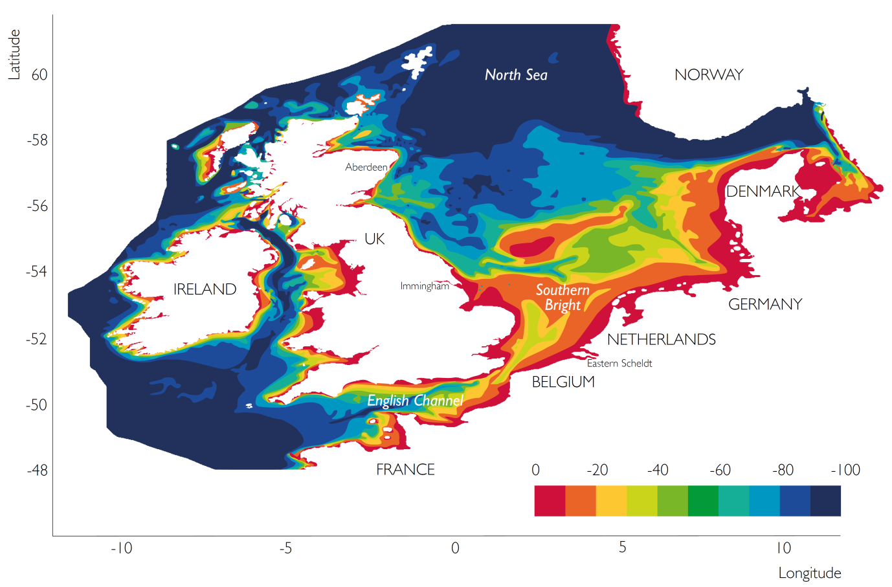

Examples
========
Here we provide two worked examples using pyNEMO. The first is a setup of the Northwest European Shelf using
a remote dataset. The second is an end-to-end setup of a small regional model in the tropics.

Example 1: Northwest European Shelf
===================================

   Northwest European Shelf Bathymetry
   

This example has been tested on the ARCHER HPC facillity *(22 Feb 2017)*.

First, create a working directory into which the code can
run. All the data required for this example are held on a
THREDDS server so no addtional data are required.

.. note:: make sure cray-netcdf-hdf5parallel cray-hdf5-parallel are loaded.
          This example has been consructed under PrgEnv-intel. e.g.

::

   module swap PrgEnv-cray PrgEnv-intel
   module load cray-netcdf-hdf5parallel
   module load cray-hdf5-parallel

.. note:: Be careful to avoid symbolic links in NEMO control files.

::

   cd $WDIR
   mkdir OUTPUT

Now we're ready to generate the boundary conditions using pyNEMO. 
If this is not installed follow the `installation guide` or a quick
setup could be as follows:

:: 

   cd ~
   module load anaconda
   conda create --name pynemo_env scipy=0.16.0 numpy matplotlib=1.5.1 basemap netcdf4 libgfortran=1.0.0
   source activate pynemo_env
   conda install -c conda-forge seawater=3.3.4
   conda install -c https://conda.anaconda.org/srikanthnagella thredds_crawler
   conda install -c https://conda.anaconda.org/srikanthnagella pyjnius
   export LD_LIBRARY_PATH=/opt/java/jdk1.7.0_45/jre/lib/amd64/server:$LD_LIBRARY_PATH
   svn checkout https://ccpforge.cse.rl.ac.uk/svn/pynemo
   cd pynemo/trunk/Python
   python setup.py build
   export PYTHONPATH=~/.conda/envs/pynemo/lib/python2.7/site-packages/:$PYTHONPATH
   python setup.py install --prefix ~/.conda/envs/pynemo
   cp data/namelist.bdy $WDIR
   cd $WDIR

Next we need to modify the namelist.bdy file to point it to the correct
data sources. First we need to create an ncml file to gather input data 
and map variable names. First we update *sn_src_dir*, *sn_dst_dir* and
*cn_mask_file* to reflect the working path (e.g. sn_src_dir = '$WDIR/test.ncml', 
sn_dst_dir = '$WDIR/OUTPUT' and cn_mask_file = '$WDIR/mask.nc'). 
Explicitly write out $WDIR. Next we need to generate test.ncml.

.. note:: pynemo may have to be run on either espp1 or espp2 (e.g. ssh -Y espp1) 
          as the JVM doesn't have sufficient memory on the login nodes.

::

   ssh -Y espp1
   module load anaconda
   source activate pynemo_env
   cd $WDIR 
   pynemo_ncml_generator   

For each of the tracer and dynamics variables enter the following URL as
the source directory:

http://esurgeod.noc.soton.ac.uk:8080/thredds/dodsC/PyNEMO/data

Add a regular expression for each (Temperature, Salinity and Sea Surface 
Height each use: .\*T\\.nc$ and the velocities use .\*V\\.nc$ and .\*V\\.nc$)
After each entry click the Add button. Finally fill in the output file 
including directory path (this should match *sn_src_dir*). Once this is complete
click on the generate button and an ncml file should be written to $WDIR.

Then using pynemo we define the area we want to model and generate some 
boundary conditions:

.. note:: I've had to add the conda env path to the $PYTHONPATH as python does
          seem to be able to pick up pyjnius!?

::

   export LD_LIBRARY_PATH=/opt/java/jdk1.7.0_45/jre/lib/amd64/server:$LD_LIBRARY_PATH
   export PYTHONPATH=~/.conda/envs/pynemo_env/lib/python2.7/site-packages:$PYTHONPATH
   pynemo -g -s namelist.bdy
 
Once the area of interest is selected and the close button is clicked,
open boundary data should be generated in $WDIR/OUTPUT.

Example 2: Lighthouse Reef
==========================

.. figure:: _static/eg2.png 
   :align:   center

   Regional Mask / SSH after 1 day / SST after 1 day
   

This example has been tested on the ARCHER HPC facillity.

First, create a working directory into which the NEMO 
source code can be checked out. Create an inputs directory
to unpack the forcing tar ball.

.. note:: make sure cray-netcdf-hdf5parallel cray-hdf5-parallel are loaded.
          This example has been consructed under PrgEnv-intel.

::

   cd $WDIR
   mkdir INPUTS
   cd INPUTS
   wget ftp.nerc-liv.ac.uk:/pub/general/jdha/inputs.tar.gz
   tar xvfz inputs.tar.gz
   rm inputs.tar.gz
   cd ../
   svn co http://forge.ipsl.jussieu.fr/nemo/svn/branches/2014/dev_r4621_NOC4_BDY_VERT_INTERP@5709
   svn co http://forge.ipsl.jussieu.fr/ioserver/svn/XIOS/branchs/xios-1.0@629
   cd xios-1.0
   cp $WDIR/INPUTS/arch-XC30_ARCHER.* ./arch
   ./make_xios --full --prod --arch XC30_ARCHER --netcdf_lib netcdf4_par

Next we setup our experiment directory and drop an updated 
dtatsd.F90 into MY_SRC to allow the vertical interpolation 
of initial conditions on to the new verictal coordinates. 
We also apply several patches for bugs in the code. 

.. note:: when executing ./makenemo for the first time only choose OPA_SRC.
          For some reason even though LIM_2 is not chosen key_lim2 is
          in the cpp keys. This means the first call to ./makenemo will fail.
          Just vi LH_REEF/cpp_LH_REEF.fcm and remove key_lim2 and re-issue
          the make command.

::

   export CDIR=$WDIR/dev_r4621_NOC4_BDY_VERT_INTERP/NEMOGCM/CONFIG
   export TDIR=$WDIR/dev_r4621_NOC4_BDY_VERT_INTERP/NEMOGCM/TOOLS
   cd $CDIR/../NEMO/OPA_SRC/SBC
   patch -b < $WDIR/INPUTS/fldread.patch
   cd ../DOM 
   patch -b < $WDIR/INPUTS/dommsk.patch
   cd ../BDY
   patch -b < $WDIR/INPUTS/bdyini.patch
   cd $CDIR
   rm $CDIR/../NEMO/OPA_SRC/TRD/trdmod.F90
   cp $WDIR/INPUTS/arch-* ../ARCH
   ./makenemo -n LH_REEF -m XC_ARCHER_INTEL -j 10
   cp $WDIR/INPUTS/cpp_LH_REEF.fcm ./LH_REEF
   cp $WDIR/INPUTS/dtatsd.F90 LH_REEF/MY_SRC/ 

To generate bathymetry, initial conditions and grid information
we first need to compile some of the NEMO TOOLS (after a small
bugfix - and to allow direct passing of arguments). For some 
reason GRIDGEN doesn't like INTEL:

::

   cd $WDIR/dev_r4621_NOC4_BDY_VERT_INTERP/NEMOGCM/TOOLS/WEIGHTS/src
   patch -b < $WDIR/INPUTS/scripinterp_mod.patch
   patch -b < $WDIR/INPUTS/scripinterp.patch
   patch -b < $WDIR/INPUTS/scrip.patch
   patch -b < $WDIR/INPUTS/scripshape.patch
   patch -b < $WDIR/INPUTS/scripgrid.patch
   cd ../../
   ./maketools -n WEIGHTS -m XC_ARCHER_INTEL
   ./maketools -n REBUILD_NEMO -m XC_ARCHER_INTEL
   module unload cray-netcdf-hdf5parallel cray-hdf5-parallel
   module swap PrgEnv-intel PrgEnv-cray
   module load cray-netcdf cray-hdf5
   ./maketools -n GRIDGEN -m XC_ARCHER
   module swap PrgEnv-cray PrgEnv-intel
   export TDIR=$WDIR/dev_r4621_NOC4_BDY_VERT_INTERP/NEMOGCM/TOOLS

.. note:: my standard ARCHER ENV is intel with parallel netcdf you may need to edit accordingly

Back in $WDIR/INPUTS, create a new coordinates file from the
existing global 1/12 mesh and refine to 1/84 degree resolution: 

::
 
   cd $TDIR/GRIDGEN
   cp $WDIR/INPUTS/namelist_R12 ./
   ln -s namelist_R12 namelist.input
   ./create_coordinates.exe 
   cp 1_coordinates_ORCA_R12.nc $WDIR/INPUTS/coordinates.nc

To create the bathymetry we use the gebco dataset. On ARCHER I
had to use a non-default nco module for netcdf operations to work.
I also had to cut down the gebco data as the SCRIP routines failed
for some unknown reason.

::

   cd $WDIR/INPUTS
   module load nco/4.5.0
   ncap2 -s 'where(topo > 0) topo=0' gebco_1_cutdown.nc tmp.nc
   ncflint --fix_rec_crd -w -1.0,0.0 tmp.nc tmp.nc gebco_in.nc
   rm tmp.nc
   module unload nco cray-netcdf cray-hdf5
   module load cray-netcdf-hdf5parallel cray-hdf5-parallel
   $TDIR/WEIGHTS/scripgrid.exe namelist_reshape_bilin_gebco
   $TDIR/WEIGHTS/scrip.exe namelist_reshape_bilin_gebco
   $TDIR/WEIGHTS/scripinterp.exe namelist_reshape_bilin_gebco
    
We perform a similar operation to create the initial conditions:

.. note:: I've put a sosie pre-step in here to flood fill the land. 
          I tried using sosie for 3D intepolation, but not convinced.

::

   cd ~
   mkdir local 
   svn co svn://svn.code.sf.net/p/sosie/code/trunk sosie
   cd sosie
   cp $WDIR/INPUTS/make.macro ./
   make
   make install
   export PATH=~/local/bin:$PATH   
   cd $WDIR/INPUTS
   sosie.x -f initcd_votemper.namelist
   sosie.x -f initcd_vosaline.namelist
   $TDIR/WEIGHTS/scripgrid.exe namelist_reshape_bilin_initcd_votemper
   $TDIR/WEIGHTS/scrip.exe namelist_reshape_bilin_initcd_votemper
   $TDIR/WEIGHTS/scripinterp.exe namelist_reshape_bilin_initcd_votemper
   $TDIR/WEIGHTS/scripinterp.exe namelist_reshape_bilin_initcd_vosaline

Finally we setup weights files for the atmospheric forcing:

::

   $TDIR/WEIGHTS/scripgrid.exe namelist_reshape_bilin_atmos
   $TDIR/WEIGHTS/scrip.exe namelist_reshape_bilin_atmos
   $TDIR/WEIGHTS/scripshape.exe namelist_reshape_bilin_atmos
   $TDIR/WEIGHTS/scrip.exe namelist_reshape_bicubic_atmos
   $TDIR/WEIGHTS/scripshape.exe namelist_reshape_bicubic_atmos

Next step is to create the mesh and mask files that will be used 
in the generation of the open boundary conditions:

::

   cd $CDIR
   cp $WDIR/INPUTS/cpp_LH_REEF.fcm LH_REEF/
   ln -s $WDIR/INPUTS/bathy_meter.nc $CDIR/LH_REEF/EXP00/bathy_meter.nc 
   ln -s $WDIR/INPUTS/coordinates.nc $CDIR/LH_REEF/EXP00/coordinates.nc 
   cp $WDIR/INPUTS/runscript $CDIR/LH_REEF/EXP00
   cp $WDIR/INPUTS/namelist_cfg $CDIR/LH_REEF/EXP00/namelist_cfg
   cp $WDIR/INPUTS/namelist_ref $CDIR/LH_REEF/EXP00/namelist_ref
   ./makenemo clean
   ./makenemo -n LH_REEF -m XC_ARCHER_INTEL -j 10
   cd LH_REEF/EXP00
   ln -s $WDIR/xios-1.0/bin/xios_server.exe xios_server.exe
   qsub -q short runscript

If that works, we then need to rebuild the mesh and mask files in 
to single files for the next step:

::

   $TDIR/REBUILD_NEMO/rebuild_nemo -t 24 mesh_zgr 96
   $TDIR/REBUILD_NEMO/rebuild_nemo -t 24 mesh_hgr 96
   $TDIR/REBUILD_NEMO/rebuild_nemo -t 24 mask 96
   mv mesh_zgr.nc mesh_hgr.nc mask.nc $WDIR/INPUTS
   rm mesh_* mask_* LH_REEF_0000*
   cd $WDIR/INPUTS

Now we're ready to generate the boundary conditions using pyNEMO. 
If this is not installed follow the `installation guide` or a quick
setup could be as follows:

:: 

   cd ~
   module load anaconda
   conda create --name pynemo_env scipy=0.16.0 numpy matplotlib=1.5.1 basemap netcdf4 libgfortran=1.0.0
   source activate pynemo_env
   conda install -c conda-forge seawater=3.3.4
   conda install -c https://conda.anaconda.org/srikanthnagella thredds_crawler
   conda install -c https://conda.anaconda.org/srikanthnagella pyjnius
   export LD_LIBRARY_PATH=/opt/java/jdk1.7.0_45/jre/lib/amd64/server:$LD_LIBRARY_PATH
   svn checkout https://ccpforge.cse.rl.ac.uk/svn/pynemo
   cd pynemo/trunk/Python
   python setup.py build
   export PYTHONPATH=~/.conda/envs/pynemo/lib/python2.7/site-packages/:$PYTHONPATH
   python setup.py install --prefix ~/.conda/envs/pynemo
   cd $WDIR/INPUTS

Start up pynemo and generate boundary conditions. First we need to
create a few ncml files to gather input data and map variable names.
Then using pynemo we define the area we want to model:

.. note:: pynemo may have to be run on either espp1 or espp2 (e.g. ssh -Y espp1) 
          as the JVM doesn't have sufficient memory on the login nodes.

::

   ssh -Y espp1
   module load anaconda
   source activate pynemo_env
   cd $WDIR/INPUTS 
   pynemo_ncml_generator   

.. note:: The ncml files already exist in the INPUTS directory. There is no need
          generate them. It's a little tricky at the momment as the ncml generator
          doesn't have all the functionality required for this example. Next step
          is to fire up pynemo. You can change the mask or accept the default by just
          hitting the close button (that really should say 'build' or 'go' or such like).
          Also I've had to add the conda env path to the $PYTHONPATH as python does
          seem to be able to pick up pyjnius!?

::

   export LD_LIBRARY_PATH=/opt/java/jdk1.7.0_45/jre/lib/amd64/server:$LD_LIBRARY_PATH
   export PYTHONPATH=~/.conda/envs/pynemo_env/lib/python2.7/site-packages:$PYTHONPATH
   pynemo -g -s namelist.bdy

Let's have a go at running the model after exiting espp1 (after a few variable
renamings, due to inconsistencies to be ironed out):

::
 
   exit
   cd $WDIR/INPUTS
   module unload cray-netcdf-hdf5parallel cray-hdf5-parallel
   module load nco/4.5.0
   ncrename -v deptht,gdept LH_REEF_bdyT_y1980m01.nc
   ncrename -v depthu,gdepu LH_REEF_bdyU_y1980m01.nc
   ncrename -v depthv,gdepv LH_REEF_bdyV_y1980m01.nc
   module unload nco
   module load cray-netcdf-hdf5parallel cray-hdf5-parallel
   cd $CDIR/LH_REEF/EXP00
   ln -s $WDIR/INPUTS/coordinates.bdy.nc $CDIR/LH_REEF/EXP00/coordinates.bdy.nc 
   sed -e 's/nn_msh      =    3/nn_msh      =    0/' namelist_cfg > tmp
   sed -e 's/nn_itend    =      1/nn_itend    =       1440 /' tmp > namelist_cfg
   cp $WDIR/INPUTS/*.xml ./
   qsub -q short runscript
