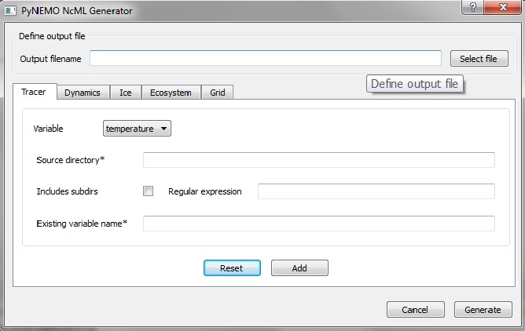

pyNEMO NcML Generator Usage
===========================

This GUI tool facilitates the creation of a virtual dataset for input into pyNEMO.  The virtual dataset is defined using NetCDF Markup Language (`NcML <http://www.unidata.ucar.edu/software/thredds/current/netcdf-java/ncml/Tutorial.html>`_ ).

Using NcML, it is possible to:

1.  modify metadata
2.  modify and restructure variables
3.  combine or aggregate data from multiple datasets.  The datasets may reside in the local file system or in a remote OPeNDAP (http://www.opendap.org/) server.

Generator GUI
^^^^^^^^^^^^^

.. _NcML_gui:

   Overview of the NcML Generator GUI.

Users need to follow three distinct steps when using the GUI to generate the virtual dataset:

1.  Define a target output NcML file
2.  Define the individal variable
3.  Generate the NcML file

Define a Target Output File
---------------------------

User should provide the path and name of the target NcML file.  The convention is to use *.ncml* as the file suffix.  The target file can be specified manually using the input text box or visually using the *Select file* button.  Clicking the button will bring up a file dialogue. 

Define the Individual Data Variable
-----------------------------------

The nemo data variables are grouped into the following types :

1.  Tracer (temperature, salinity)
2.  Dynamics (zonal velocity, meridian velocity, sea surface height)
3.  Ice (ice thickness, leads fraction, snow thickness)
4.  Ecosystem (reserved for future use)
5.  Grid (reserved for future use)

Users can access the required variable by selecting the tab widget and the variable from the *Variable* dropdown list.

.. _NcML_gui_completed:
.. figure::  _static/add-variable.jpg
   :align:   center

   Example definition of the *Ice thickness variable*.

For each variable, users must provide information for:

*  Source directory - the location of the folder containing the input datasets.  User can provide an absolute path to a local file folder or an OPeNDAP endpoint, e.g. http://esurgeod.noc.soton.ac.uk:8080/thredds/dodsC/PyNEMO/data/ 
*  Existing variable name - name used in the source datasets

Users may further filter the source datasets using:

* Include subdirs - check the box to include contents in the sub directories under the specified *Source directory*
* Regular expression - provides a search pattern for filtering the files. See the **Regex** section below for more information.

After completing the variable form, users should click the *Add* button to store the input value.  Alternatively, users can use the *Reset* button to reset the input to the previously saved values. If there are no existing values, the variable tab will be reset to the default state.

Generate the NcML file
----------------------

After adding all the variables, users can generate the NcML file by clicking the *Generate* button.  If the operation is successful, a pop-up confirmation dialogue will appear.  The generated NcML file can then be used in the bdy file to set up the NEMO simulation.

Regular Expression (Regex)
^^^^^^^^^^^^^^^^^^^^^^^^^^
Regular expression is a special text string for describing a search pattern to match against some text.  You may compare using regex to filter what files to include in your datasets against using wildcard (*) to specify a file search pattern in your computer.  

A detailed description of how to define regular expression for filtering datasets in NcML is available at http://www.unidata.ucar.edu/software/thredds/current/netcdf-java/ncml/AnnotatedSchema4.html#regexp.  

The following table provides some typical examples of regex:

+---------------+------------------------+---------------------------+
|  Regex        |  Matching File Path    |        Description        |
+===============+========================+===========================+
| .*V\\.nc$     | c:/dir/dir/dir/abcV.nc | The file path ends in     |
+---------------+------------------------+---------------------------+
|               | d:/muV.nc              | V.nc                      |
+---------------+------------------------+---------------------------+
| .*\\.nc$      | c:/dir/dir/dir/\*.nc   | The file suffix is  nc    |
+---------------+------------------------+---------------------------+
|               | d:/\*.nc               |                           |
+---------------+------------------------+---------------------------+
|.*/2015.*\\.nc$| c:/dir/2015_01_16.nc   | The file path contains    |
+---------------+------------------------+---------------------------+
|               | d:/2015*.nc            | 2015 and the file suffix  |
+---------------+------------------------+---------------------------+
|               | e:/a/b/c/20151106T.nc  | is   nc                   |
+---------------+------------------------+---------------------------+
