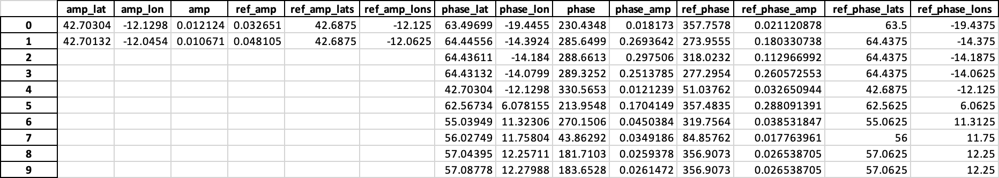

Tidal Boundary Conditions Generation
====================================

By providing a global tidal model dataset (TPXO and FES are currently supported) PyNEMO can generate boundary conditions for the
NEMO configuration supplied using the namelist file.

Namelist options
----------------

To use the namelist needs to be configured with the required options. These are listed below::

    ln_tide        = .true.              !  =T : produce bdy tidal conditions
    sn_tide_model  = 'fes'                !  Name of tidal model (fes|tpxo)
    clname(1)      = 'M2'                 !  constituent name
    clname(2)      = 'S2'
    clname(3)      = 'O1'
    clname(4)      = 'K1'
    clname(5)      = 'N2'
    ln_trans       = .false.               !  interpolate transport rather than velocities
    ! TPXO file locations
    sn_tide_grid   = './grid_tpxo7.2.nc'
    sn_tide_h      = './h_tpxo7.2.nc'
    sn_tide_u      = './u_tpxo7.2.nc'
    ! location of FES data
    sn_tide_fes      = './FES/'

these options define the location of the tidal model datasets, note this differs depending on model as TPXO has all harmonic
constants in one netcdf file whereas FES has three separate netcdf files (one for amplitude two for currents) for each constant. Extra harmonics can be appended
to the clname(n) list. FES supports 34 constants and TPXO7.2 has 13 to choose from. Other versions of TPXO should work with PyNEMO
but have not been yet been tested. **NOTE** FES dataset filenames must have be in the format of constituent then type. e.g.::

    M2_Z.nc (for amplitude)
    M2_U.nc (for U component of velocity)
    M2_V.nc (for V component of velocity)

If this is not undertaken the PyNEMO will not recognise the files. TPXO data files are specified directly so these can be anyname although it is best to stick with the default
names as shown above. So far the tidal model datasets have been downloaded and used locally but could also be stored on a THREDDS server although this has
not been tested with the global tide models.

Other options include "ln_tide" a boolean that when set to true will generate tidal boundaries. "sn_tide_model" is a string that defines the model to use, currently only
"fes" or "tpxo" are supported. "ln_trans" is a boolean that when set to true will interpolate transport rather than velocities.

Harmonic Output Checker
-----------------------

There is an harmonic output checker that can be utilised to check the output of PyNEMO with a reference tide model. So far
the only supported reference model is FES but TPXO will be added in the future. Any tidal output from PyNEMO can be checked
(e.g. FES and TPXO). While using the same model used as input to check output doesn't improve accuracy, it does confirm that the
output is within acceptable/expected limits of the nearest model reference point.

There are differences as PyNEMO interpolates the harmonics and the tidal checker does not, so there can be some difference
in the values particularly close to coastlines.

The checker can be enabled by editing the following in the relevent bdy file::

    ln_tide_checker = .true.                ! run tide checker on PyNEMO tide output
    sn_ref_model    = 'fes'                 ! which model to check output against (FES only)

The boolean determines if to run the checker or not, this takes place after creating the interpolated harmonics
and writing them to disk. The string denotes which tide model to use as reference, so far only FES is supported.
The string denoting model is not strictly needed, by default fes is used.

The checker will output information regarding the checking to the NRCT log, and also write an spreadsheet to the output folder containing any
exceedance values, the closest reference model value and their locations. Amplitude and phase are checked independently, so both have latitude and longitude
associated with them. It is also useful to know the amplitude of a exceeded phase to see how much impact it will have so this
is also written to the spreadsheet. An example output is shown below, as can be seen the majority of the amplitudes, both
the two amplitudes exceedances and the ones associated with the phase exceedances are low (~0.01), so can most likely be ignored.
There a few phase exceedances that have higher amplitudes (~0.2) which would potentially require further investigation. A common
reason for such an exceedance is due to coastlines and the relevant point being further away from an FES data point.

Tide Checker Example Output for M2 U currents
---------------------------------------------

The actual thresholds for both amplitude and phase are based on the amplitude of the output or reference, this is due to
different tolerances based on the amplitude. e.g. high amplitudes should have lower percentage differences to the FES reference,
than lower ones simply due to the absolute amount of the ampltiude itself, e.g. a 0.1 m difference for a 1.0 m amplitude is
acceptable but not for a 0.01 m amplitude. The smaller amplitudes contribute less to the overall tide height so larger percentage
differences are acceptable. The same also applies to phases, where large amplitude phases have little room for differences but at
lower amplitudes this is less critical so a higher threshold is tolerated.

The following power functions are used to determine what threshold to apply based on the reference model amplitude.

Amplitude Threshold
-------------------

.. important:: Percentage Exceedance = 26.933 * Reference Amplitude ^ -0.396'

Phases Threshold
----------------

.. important:: Phase Exceedance = 5.052 * PyNEMO Amplitude ^ -0.60

Future work
-----------

Create options of harmonic constants to request rather than manually specifying a list. These could be based on common requirements
and/or based on the optimal harmonics to use for a specified time frame.

